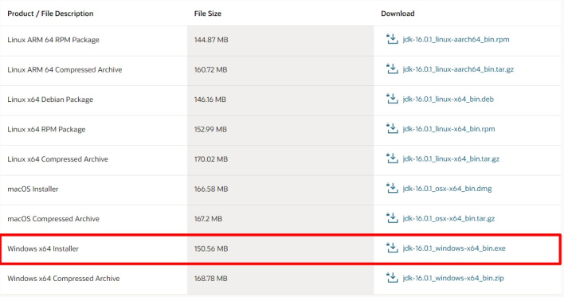

 [Home](../index.html)
# Configuración de ambiente
La configuración a continuación describe como configurar el ambiente para la implementación de una aplicación Java basada en Springboot, con la finalidad de detallar el proceso para la creación de un backend basado en API Rest.

## Instalación del JDK
Para la configuración del JDK, vamos a realizar los siguientes pasos

1. Descargue el JDK [aqui](https://www.oracle.com/java/technologies/javase-jdk16-downloads.html)
2. Para windos debe de seleccionar la siguiente opción
    
3. Luego realizamos la instalación

## IDE de desarr

